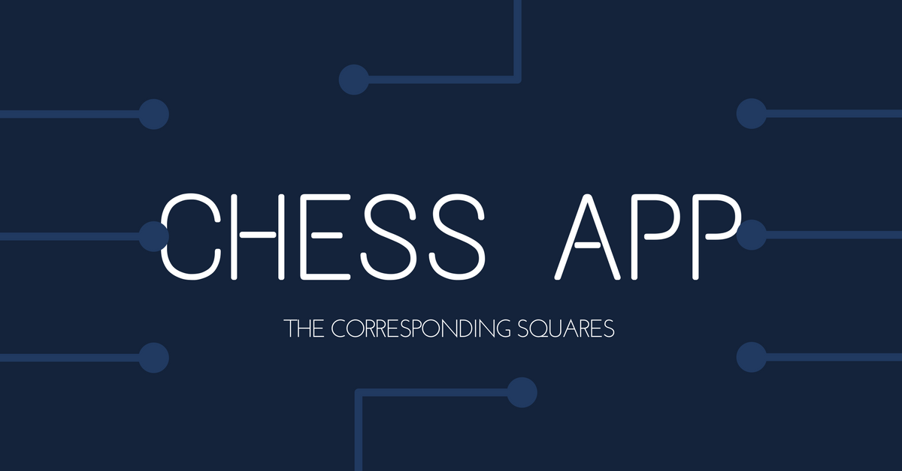

# Chess Application


[](https://codeclimate.com/github/TheCorrespondingSquares/chess-app)
[](https://codeclimate.com/github/TheCorrespondingSquares/chess-app)
[](https://codeclimate.com/github/TheCorrespondingSquares/chess-app/coverage)
[](https://travis-ci.org/TheCorrespondingSquares/chess-app)
[](https://github.com/RichardLitt/standard-readme)




> Chess Application built by The Corresponding Squares Team

## Table of Contents

- [Install](#install)
- [Usage](#usage)
- [Maintainers](#maintainers)
- [Contribute](#contribute)
- [License](#license)

## Install

```
```

## Usage

```
```

## Maintainers

Kirby James _(Engineer/Developer)_ - [https://github.com/kboygit](https://github.com/kboygit)

Justin Munn _(Engineer/Developer/Designer)_ - [https://github.com/jwmunn](https://github.com/jwmunn)

Nikhil Nadkarny _(Engineer/Developer)_ - [https://github.com/nnadkarny](https://github.com/nnadkarny)

Fisto Satianto _(Engineer/Developer)_ - [https://github.com/fistoriza](https://github.com/fistoriza)

Miguel B. _(Engineer/Developer)_ - [https://github.com/Phatkid98](https://github.com/Phatkid98)

## Contribute


Small note: If editing the README, please conform to the [standard-readme](https://github.com/RichardLitt/standard-readme) specification.

## License
